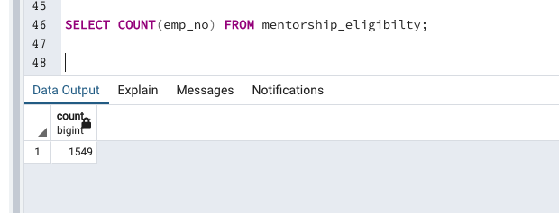

## Pewlett-Hackard-Analysis
### Overview of the Analysis
#### In this analysis Pewlett Hackard is offering reitirement package for the following employees:
#### 1. Employees who meet a certain criteria 
#### 2. Which positions need to be filled in the near future?
#### They anticipate the number of job openings due to retirement will be in thousands. 

#### Bobby is an HR anlayst whose task is to perform employee research. Bobby first runs an analysuis on:
#### 1. Who will be reitring?
#### 2. How many poistions will Pewlett Hackard need to fill? THhs analysis will help future-proof Pewlett Hackard by generating a list of employees that will be eligible for the retirement package. 

### Purpose
#### After knowing the results of how many employees will be retiring and what positions needs to be filled, Pewlett Hackard has given Bobby two more assignments. 
#### 1. Determine the number of retiring employees per title.
#### 2. Identify employees who are eligible to participate in a mentorship program.

### Results
#### 1. From the first part of our analysis, we find that the top three titles that have the largest number of retiring employees are 'Senior Engineer,', 'Senior Staff' and 'Engineer'.
#### 2. From our second report to find te employees eligible for the mentorship program. We see that only 1549 qualify for the mentoship program from the 90,000 employees who will be retiring. Pewlett Hackard needs to expand their critera so more retiring employees can qualify for the mentorship program.

#### The number of retiring employees per title:

#### Employees eligible to participate in a mentorship program:

### Summary:

The ratio between total retiring and total eligible mentee is 1:58 which is very large. Pewlett Hackard needs to find a way to bridge this huge gap.

#### Total Retiring

#### Total Eligible Mentee 

--------------------------------------------------------------

#### Mentee Count by Title
From the Mentee count by title, we see that the largest retiring titles, also have the largest mentee count. But the ratio is 1:52 mentee/retiring.To increase the number of mentees for the top three retiring titles, Pewlett Hackard have to expand their mentorship program criteria.

